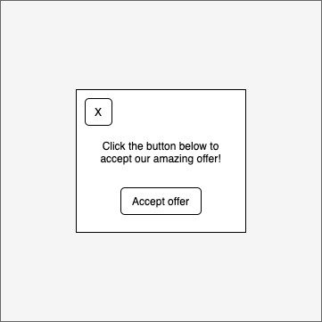

## Prompt:

Create a dismissible modal overlay. The UI should initially show a 'Show offer' button which, when clicked, displays an overlay resembling the mockup below, including a transparent grey overlay over the background. The modal should be vertically and horizontally centered, and always in the same position regardless of scrolling.

### Extensions:

Can you extend the UI to support multiple modals? For example, the UI should have buttons for 'Show offer one' and 'Show offer two'. If the user accepts offer one, that modal button should change to 'Accepted offer one', and the UI should still have the 'Show offer two' button

Make it so that the Esc key closes the modal as well

Make the modal responsive so that on mobile web the modal takes up the entire browser window

If the page is longer than one screen (has a vertical scrollbar), prevent scrolling when the modal is open
